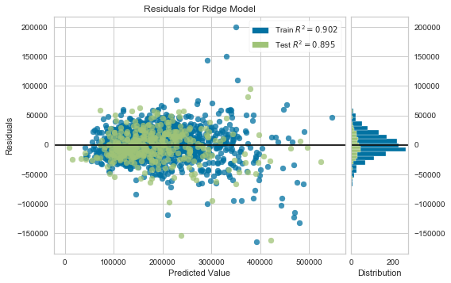

#  Project 2 - Ames Housing Data and Kaggle Challenge

## Contents:
- [Overview and Problem Statement](#Overview-and-Problem-Statement)
- [Summary of Dataset](#Summary-of-Dataset)
  1. [Brief description of datasets](#Brief-description-of-datasets)
  2. [Brief Data Dictionary](#Brief-Data-Dictionary)
- [Data Cleaning Process](#Data-Cleaning-Process)
- [EDA and Feature Selection Process](#EDA-and-Feature-Selection-Process)
- [Model Selection and Evaluation](#Model-Selection-and-Evaluation)
- [Executive Summary](#Executive-Summary)
  1. [Summary of Model](#Summary-of-Model)
  2. [Possible Inferences](#Possible-Inferences)

---
## Overview and Problem Statement

**1.** Based on the dataset given, are we able to build a robust model which will help us predict/estimate the value (_Sale Price_) of a house in Ames, Iowa?

**2.** From the final model, what are we able to infer about the major factors influencing the value of a house in Ames, Iowa?

**3.** What other possible methods of getting a more robust prediction?

---
## Summary of Dataset

### <u>Brief description of datasets</u>

**NAME:** AmesHousing.txt

**TYPE:** Population

**SIZE:** 2930 observations, 82 variables

**ARTICLE TITLE:** Ames Iowa: Alternative to the Boston Housing Data Set

**DESCRIPTIVE ABSTRACT:** Data set contains information from the Ames Assessor’s Office used in computing assessed values for individual residential properties sold in Ames, IA from 2006 to 2010.

**SOURCES:**
Ames, Iowa Assessor’s Office

**VARIABLE DESCRIPTIONS:**
Tab characters are used to separate variables in the data file. The data has 82 columns which include 23 nominal, 23 ordinal, 14 discrete, and 20 continuous variables (and 2 additional observation identifiers).

**Distribution of Sale Price (target feature):**

<b>Mean:</b> $181,408.56

<b>Min:</b> $12,789.00

<b>Max:</b> $611,657.00

### <u>Brief Data Dictionary</u>

Data Dictionary of the initial datasets (_before feature engineering_):

| Feature              | Type         | Description                                                                 |
|:---------------------|:-------------|:----------------------------------------------------------------------------|
| Id                   | N.A.         | Name of States                                                              |
| PID                  | Nominal      | Parcel Identification Number                                                |
| MS SubClass          | Nominal      | Identifies the type of dwelling                                             |
| MS Zoning            | Nominal      | Identifies the general zoning classification                                |
| Lot Frontage         | Continuous   | Lot size in square feet                                                     |
| Lot Area             | Continuous   | Lot size in square feet                                                     |
| Street               | Nominal      | Type of road access to property                                             |
| Alley                | Nominal      | Type of alley access to property                                            |
| Lot Shape            | Ordinal      | General shape of property                                                   |
| Land Contour         | Nominal      | Flatness of the property                                                    |
| Utilities            | Ordinal      | Type of utilities available                                                 |
| Lot Config           | Nominal      | Lot configuration feet                                                      |
| Land Slope           | Ordinal      | Slope of property feet                                                      |
| Neighborhood         | Nominal      | Physical locations within Ames city limits                                  |
| Condition 1          | Nominal      | Proximity to various conditions property                                    |
| Condition 2          | Nominal      | Proximity to various conditions (if more than one is present) property      |
| Bldg Type            | Nominal      | Type of dwelling                                                            |
| House Style          | Nominal      | Style of dwelling available                                                 |
| Overall Qual         | Ordinal      | Rates the overall material and finish of the house feet                     |
| Overall Cond         | Ordinal      | Rates the overall condition of the house feet                               |
| Year Built           | Discrete     | Original construction date property                                         |
| Year Remod/Add       | Discrete     | Remodel date                                                                |
| Roof Style           | Nominal      | Type of roof property                                                       |
| Roof Matl            | Nominal      | Roof material                                                               |
| Exterior 1           | Nominal      | Exterior covering on house available                                        |
| Exterior 2           | Nominal      | Exterior covering on house (if more than one material)                      |
| Mas Vnr Type         | Nominal      | Masonry veneer type                                                         |
| Mas Vnr Area         | Continuous   | Masonry veneer area in square feet                                          |
| Exter Qual           | Ordinal      | Evaluates the quality of the material on the exterior available             |
| Exter Cond           | Ordinal      | Evaluates the present condition of the material on the exterior             |
| Foundation           | Nominal      | Type of foundation                                                          |
| Bsmt Qual            | Ordinal      | Evaluates the height of the basement property                               |
| Bsmt Cond            | Ordinal      | Evaluates the general condition of the basement date                        |
| Bsmt Exposure        | Ordinal      | Refers to walkout or garden level walls property                            |
| BsmtFin Type 1       | Ordinal      | Rating of basement finished area material                                   |
| BsmtFin SF 1         | Continuous   | Type 1 finished square feet                                                 |
| BsmtFinType 2        | Ordinal      | Rating of basement finished area (if multiple types)                        |
| BsmtFin SF 2         | Continuous   | Type 2 finished square feet                                                 |
| Bsmt Unf SF          | Continuous   | Unfinished square feet of basement area                                     |
| Total Bsmt SF        | Continuous   | Total square feet of basement area                                          |
| Heating              | Nominal      | Type of heating                                                             |
| HeatingQC            | Ordinal      | Heating quality and condition                                               |
| Central Air          | Nominal      | Central air conditioning                                                    |
| Electrical           | Ordinal      | Electrical system                                                           |
| 1st Flr SF           | Continuous   | First Floor square feet                                                     |
| 2nd Flr SF           | Continuous   | Second floor square feet                                                    |
| Low Qual Fin SF      | Continuous   | Low quality finished square feet (all floors)                               |
| Gr Liv Area          | Continuous   | Above grade (ground) living area square feet                                |
| Bsmt Full Bath       | Discrete     | Basement full bathrooms                                                     |
| Bsmt Half Bath       | Discrete     | Basement half bathrooms                                                     |
| Full Bath            | Discrete     | Full bathrooms above grade                                                  |
| Half Bath            | Discrete     | Half baths above grade                                                      |
| Bedroom              | Discrete     | Bedrooms above grade (does NOT include basement bedrooms)                   |
| Kitchen              | Discrete     | Kitchens above grade                                                        |
| KitchenQual          | Ordinal      | Kitchen quality                                                             |
| TotRmsAbvGrd         | Discrete     | Total rooms above grade (does not include bathrooms)                        |
| Functional           | Ordinal      | Home functionality (Assume typical unless deductions are warranted)         |
| Fireplaces           | Discrete     | Number of fireplaces                                                        |
| FireplaceQu          | Ordinal      | Fireplace quality                                                           |
| Garage Type          | Nominal      | Garage location                                                             |
| Garage Yr Blt        | Discrete     | Year garage was built                                                       |
| Garage Finish        | Ordinal      | Interior finish of the garage                                               |
| Garage Cars          | Discrete     | Size of garage in car capacity                                              |
| Garage Area          | Continuous   | Size of garage in square feet                                               |
| Garage Qual          | Ordinal      | Garage quality                                                              |
| Garage Cond          | Ordinal      | Garage condition                                                            |
| Paved Drive          | Ordinal      | Paved driveway                                                              |
| Wood Deck SF         | Continuous   | Wood deck area in square feet                                               |
| Open Porch SF        | Continuous   | Open porch area in square feet                                              |
| Enclosed Porch       | Continuous   | Enclosed porch area in square feet                                          |
| 3-Ssn Porch          | Continuous   | Three season porch area in square feet                                      |
| Screen Porch         | Continuous   | Screen porch area in square feet                                            |
| Pool Area            | Continuous   | Pool area in square feet                                                    |
| Pool QC              | Ordinal      | Pool quality                                                                |
| Fence                | Ordinal      | Fence quality                                                               |
| Misc Feature         | Nominal      | Miscellaneous feature not covered in other categories                       |
| Misc Val             | Continuous   | Value of miscellaneous feature                                              |
| Mo Sold              | Discrete     | Month Sold (MM)                                                             |
| Yr Sold              | Discrete     | Year Sold (YYYY)                                                            |
| Sale Type            | Nominal      | Type of sale                                                                |
| Sale Condition       | Nominal      | Condition of sale                                                           |
| SalePrice            | Continuous   | Sale price                                                                  |

**Note:** For _Ordinal_ data type, visit http://jse.amstat.org/v19n3/decock/DataDocumentation.txt for the various ordinal values.

---
## Data Cleaning Process

**_Brief summary of the data cleaning process:_**

**1. Importing Data**

**2. Data Cleaning:**

  Replacing all NULL values with the respective values (based on data documentation), if information is not mentioned in data documentation, deductive imputation is used.

**3. Final check before EDA**

**4. Exporting for EDA**

---
## EDA and Feature Selection Process

**_Brief summary of the EDA & feature selection process:_**

**1. Importing Data**

**2. Splitting dataframe into features (X) & targets (y)**

**3. Cleaning training set (removing outliers)**

  Plotting numerical variables on boxplot and removing extreme outliers.

   _Since the purpose of this model more for prediction (not as much for inference), dropping extreme outliers will help to keep our features within a reasonable range for regression later on._

   Dropped a total of 5 entries.

**4. Feature Engineering of Numerical Data**

  Creating Polynomial Features to the power of 2 in hope that the increased complexity will better predict the target variable.
  
  <i>Bearing in mind that an increase in power of the features will make the inference portion highly complex and hence much harder to explain.</i>

**5. EDA: Preliminary Feature Elimination through Filter Methods**

  Did a preliminary elimination of features through filter methods.

  | Data Type        | Statistical Method Employed                                             |
  |:-----------------|:------------------------------------------------------------------------|
  | Numerical        | Pearson's correlation. Features with R < -/+0.6 dropped                 |
  | Ordinal          | Label Encoded. Pearson's correlation. Features with R < -/+ 0.4 dropped |
  | Nominal          | Label Encoded. ANOVA. Features which we are unable to reject null hypothesis (_of means being the same_) at 95% significance level, dropped |

**6. Encoding Categorical(Ordinal & Nominal) Features**

**7. Combining encoded features (X) & targets (y) for Export**

**8. Exporting the file for Model Selection**

---
## Model Selection and Evaluation

**_Brief summary of the model selection & evaluation process:_**

**1. Importing Data**

**2. Initial Scaling with all features (for RFE)**

  Scaling train features for the purpose of RFE

**3. Feature Selection through Wrapper Method RFECV on remaining features**

  Previously we used statistical tests (filter method) to eliminate features which have statistically low significance on the target variable. For this portion, we will use sklearn's RFE to help further reduce the number of features to 25.

**4. Extracting right features from the Kaggle test data & scaling it with training data**

  For use on model later on

**5. Model Selection**

  Did a Cross Validation check on Linear, Lasso, Ridge & ElasticNet models using the 25 selected features from RFE.

  _Note: Regularized models (Lasso, Ridge, ENet) are optimized using their respective cross-validation functions_

**6. Evaluation of selected model (Ridge)**

  The Ridge Regression model outperformed the other models slightly and we have chosen to use it as the final model for this project.

  <u><b>Methodology for evaluation</b></u>

  We do not have a test set with actual targets (kaggle test set does not come with targets). So instead we will just split the initial training set into train and test again to run this check.

  Do note that the optimized & trained model was trained on and has **ALREADY SEEN** (models were optimized with the entire train set) the data we will be using for validation, as such we will be doing the following to try and mitigate the impact:
  
  1. train_test_split the train data
  
  2. We will retrain the model with optimized hyper parameters using the training split
  
  3. We will then test the retrained model on the test split

  This is just to have a rough sense of how our model is and will be performing.

**7. Exporting results using best model for Kaggle submission**

---
## Executive Summary

### <u>Summary of Model</u>
<u><b>Checking for violations of assumptions</b></u>

<b>Prediction VS Actual Sale Price Plot</b>

<b>Residual Plot</b>

From the graphs above, it seems that normality of residual errors assumption is not violated.

However, we do see that the  of the residual errors are not homoscadastic (not so evident from the prediction vs actual plot, but seemingly more evident from the residual plot). The variance of the errors seem to increase for higher Sale Prices.

Perhaps a higher level model like Neural Networks & Random Forests would be able to handle the change in variance at the higher Sale Prices better. Or maybe introduce even more complex features (_i.e. polynomial features to higher powers_)

The regression model seem to be decent (for houses below approx. $250,000-$300,000) but I believe not to be the best possible.

### <u>Possible Inferences</u>

<b>Coefficient Plot</b>

<b><i>It will be very difficult to explain the higher polynomial features, as such, we will only be focusing on the first order features for the purpose of this project</i></b>

<b>1.</b> The feature with the greatest impact on the value of the house is <b>Overall Quality</b>.

<b>2.</b> In general, it seems that a huge area (<i>Total Bsmt Area, Gr Liv Area, Garage Area</i>) for the house does not guarantee a high Sale Price.

   <i>In fact, the regression model itself seem to suggest otherwise.</i>
  
<b>3.</b> The model seem to suggest that having a higher quality (<i>Overall, Exter, Bsmt, Fireplace, Kitchen Qual</i>) in general will have a positive effect on the Sale Price. A logical relationship.

<b>4.</b> A later year of remodification/addition (<i>Year Remod/Add</i>) seemed to have a positive impact on the Sale Price. A logical relationship (a newly fitted/renovated house would be worth more)

<i>Once again, bear in mind that the increase in power of the features has made the inference portion highly complex and hence much harder to explain. To have a better explanation of things, we can do a regression model <b>without</b> so many unexplained polynomial features.</i>

<u><b>In Summary</b></u>

  A point which I find interesting from this model is that in general, the area of the house seemed to have an inverse impact on its value.

  Further studies can be done on the repercussions of a house having a huge area. Perhaps after exceeding a certain threshold area, house maintenance would be increasingly difficult, resulting in a reduction of house quality.

  Another interesting study could be on the trade-off between having a huge area and the general quality maintained.
